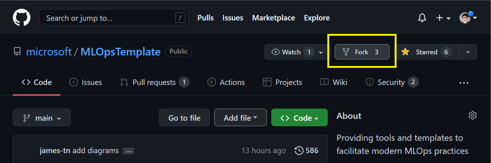
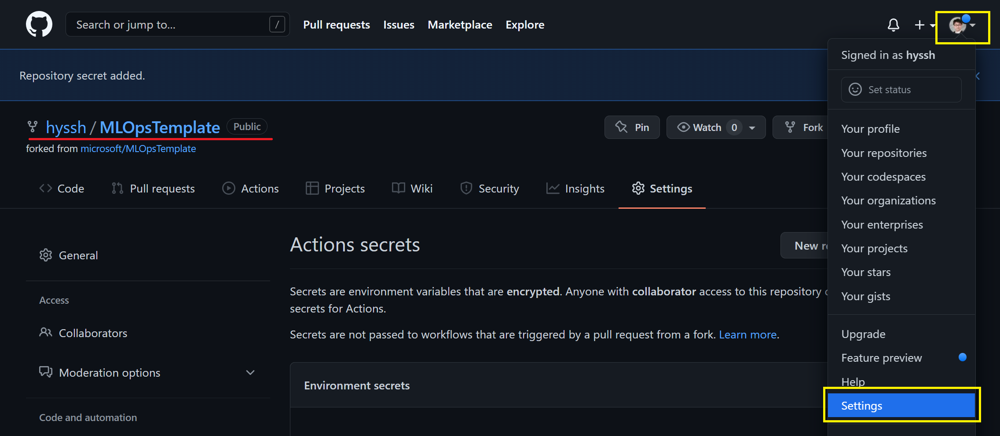
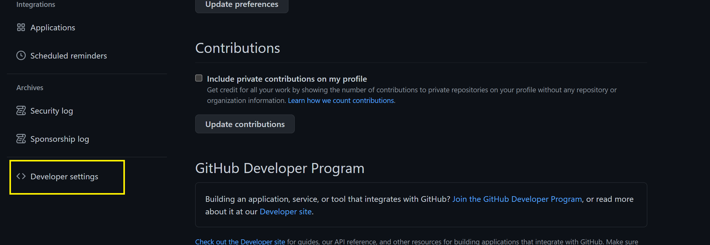
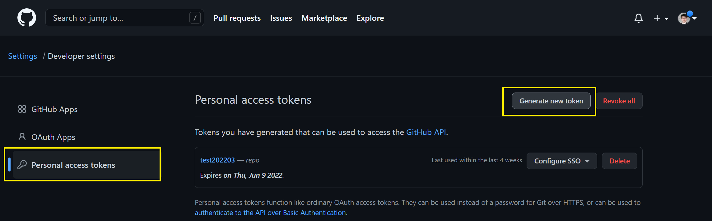
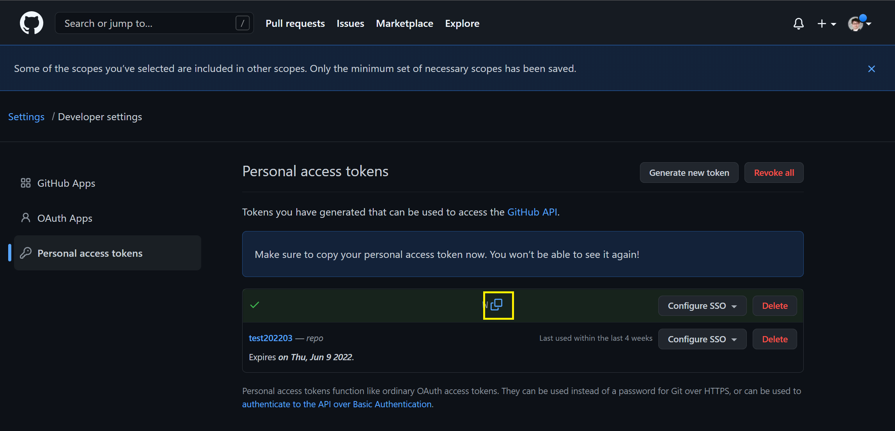
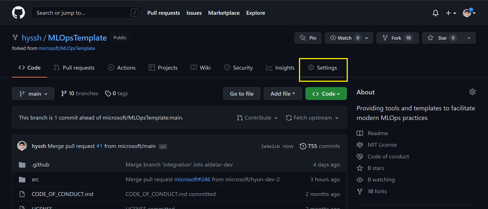
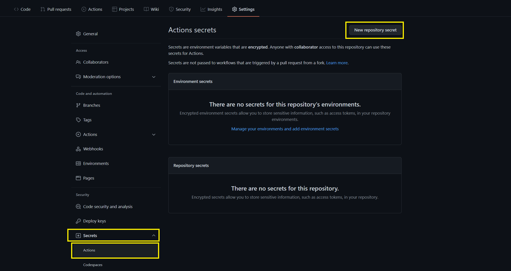
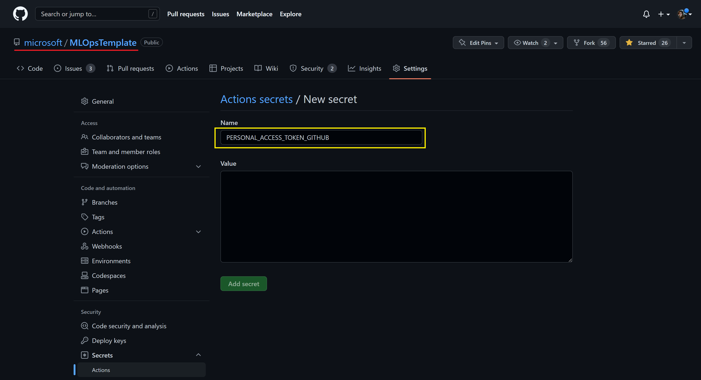
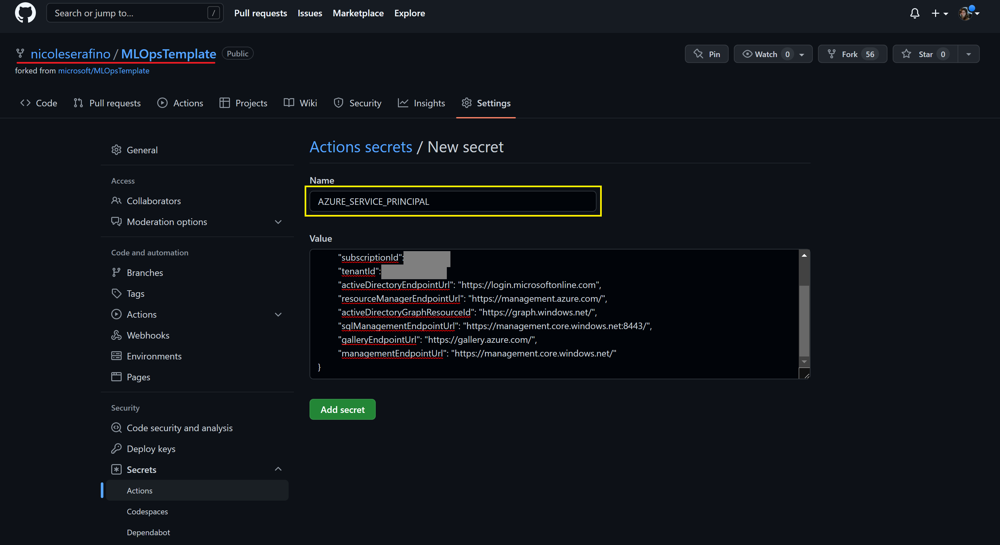

# Part 0: Workshop Environment Setup
> NOTE: The Workshop is designed to take place in a customer environment and requires an Azure AD Service Principal, including the Azure AD token for the Service Principal. Many data science and ML platform teams will need to submit a service request for a Service Principal. Plan in enough time for this service request to be processed.

Read the Workshop scenario overview [here](https://github.com/microsoft/MLOpsTemplate/blob/main/src/workshop/README.md#workshop-scenario)

The steps described here in Part 0 prepare Azure Databricks, Azure DevOps, and an Azure AD Service Principal to serve as the MLOps platform. These steps are to be performed by the platform administrators so that data scientists can start with Part 1 without getting overwhelmed with the infrastructure details involved in getting the core pieces of the MLOps platform linked together.

## Pre-requisites for Part 0
- An Azure Account and Subscription
- Permission to create, or access to, an Azure AD Service Principal
- An understanding of:
    - Azure Subscriptions and Resource Groups
    - Azure AD Service Principals
    - Git mechanics (in this workshop we use Azure Repos and Databricks Repos)

## Steps
0. [Check list](./part_tips.md)  

1. [Create a Service Principal in Azure Active Directory (Azure AD).](#1-Create-an-Azure-AD-Service-Principal)
2. [Add the Service Principal to your Azure Databricks workspace.](#2-Add-the-Service-Principal-to-your-Azure-Databricks-workspace)
3. [Generate an Azure AD token for the Service Principal.](#3-generate-an-azure-ad-token-for-the-service-principal)
4. [Set up Azure Repo account.](#4-set-up-azure-repo-account)
5. [Set up Azure DevOps.](#5-set-up-azure-devops)
6. [Generate and store data.](#6-generate-and-store-data)


## 1. Create an Azure AD Service Principal

> NOTE: You can skip this section if you've been provided an Azure AD Service Principal.


> IMPORTANT: If this deployment fails, you cannot do the following steps in the workshop. Please inform your CSA or lab instructor with the error message.

## 2. Add the Service Principal to your Azure Databricks workspace

[TODO: replace the actions here with revised instructions]

- 2.1 From the new browser tab, go to [Github](https://github.com/) and login to your account.
    > Note: If you don't have an account for Github, please sign up. The workshop can't be done without a Github account.

- 2.2 After the login, go to [https://github.com/microsoft/MLOpsTemplate](https://github.com/microsoft/MLOpsTemplate) and click `Fork`.
    

    > Note: You will have the same repository (`MLOpsTemplate`) under your Github account name.
    > Leave the tab open and **do not** close it yet. You will come back to your repository.

## 3. Generate an Azure AD token for the Service Principal

[TODO: replace the actions here with revised instructions]


```bash
git config --global credential.helper store
```


## 4. Set up Azure Repo account

[TODO: replace the actions here with revised instructions]


The last two tasks include:
   - Creating a Personal Access Token (PAT) in Github
   - Adding a Service Principal (SP) to your forked repository in Github


### 4.1 Create PAT (Personal Access Token)

You are going to create PAT to allow your code access your personal git repo

- To make PAT, you need to go to Settings of your account, NOT repo setting

    

- From the setting, find and __click__ '_<> Developer settings_' menu at the bottom left conner of your screen

    

- __Click__ '_Personal access token_' and __click__ '_Generate new token_'

    

- Check for '_repo_' and '_workflow_' for the scope and then __click__ '_create_' at the bottom of your screen

    

- You'll see the token. Make sure you copy and keep it safe. 

    

- Now you're going to add the token to your repo

- Go back to your 'MLOpsTemplate' repo where your forked from microsoft/MLOpsTemplate

    - The url of your repo will looks like this

        ```text
        https://github.com/{YOURACCOUNT}}/MLOpsTemplate
        ```

- From your repo __click__ '_Setting_'

    

- Find a menu '_Secrets_' on the left side of menu, and __click__ 'Actions'. After that __Click__ 'New repository secret'

    

- Type `PERSONAL_ACCESS_TOKEN_GITHUB` for the name of the secret, and paste the token you copied from PAT section

    > Important: The name for this secret must be `PERSONAL_ACCESS_TOKEN_GITHUB`

    


### 4.2 Add SP to your repo in Github

From this section, you'll add the SP information to your repo. The SP information will be used during the Github Actions.

You have saved in step A9, B9 or C7 the output of the SP creation command, it should look like this:

```json
{
	"clientId": "YOUR_APP_ID",
	"clientSecret": "YOUR_CLIENT_SECRET",
	"subscriptionId": "SUB_ID",
	"tenantId": "TENANT_ID",
	"activeDirectoryEndpointUrl": "https://login.microsoftonline.com",
	"resourceManagerEndpointUrl": "https://management.azure.com/",
	"activeDirectoryGraphResourceId": "https://graph.windows.net/",
	"sqlManagementEndpointUrl": "https://management.core.windows.net:8443/",
	"galleryEndpointUrl": "https://gallery.azure.com/",
	"managementEndpointUrl": "https://management.core.windows.net/"
}
```

- Go back to your 'MLOpsTemplate' repo where your forked from microsoft/MLOpsTemplate

    - The url of your repo will looks like this

        ```text
        https://github.com/{YOURACCOUNT}}/MLOpsTemplate
        ```

- From your repo __click__ '_Setting_'

    

- Find a menu '_Secrets_' on the left side of menu, and __click__ 'Actions'. After that __Click__ 'New repository secret'

    

- Type `AZURE_SERVICE_PRINCIPAL` for the name of the secret, and paste your SP json definition:

    > Important: The name for this secret must be `AZURE_SERVICE_PRINCIPAL`

    

## 5. Set up Azure DevOps

## 6. Generate and store data

## [Go to Part 1](part_1.md)
