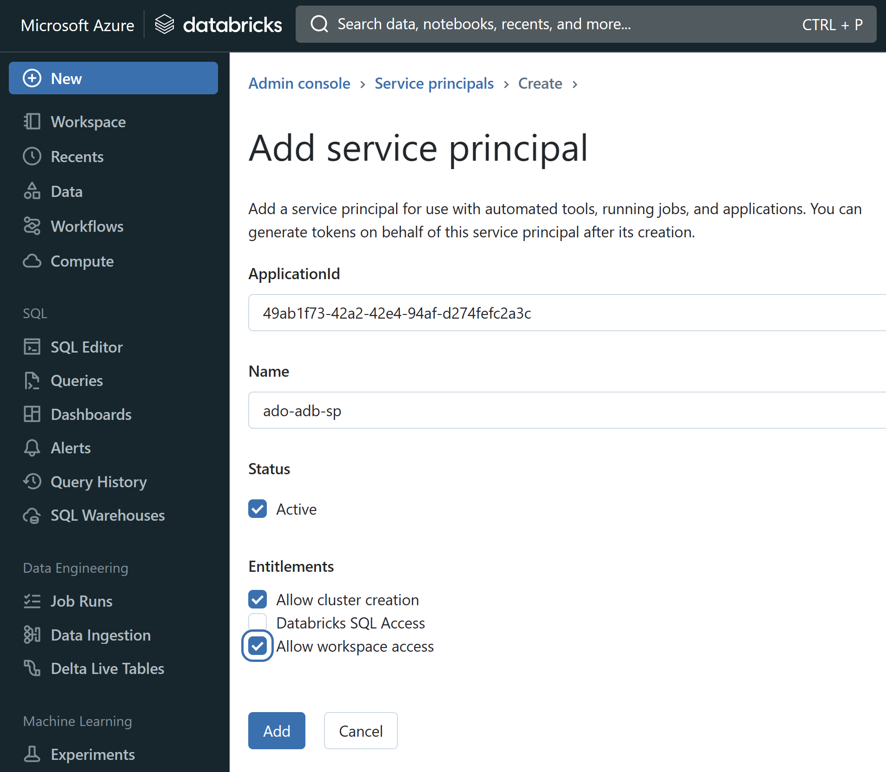
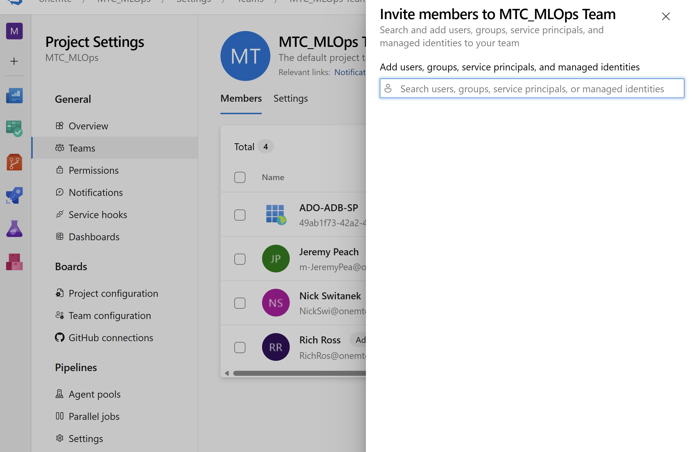
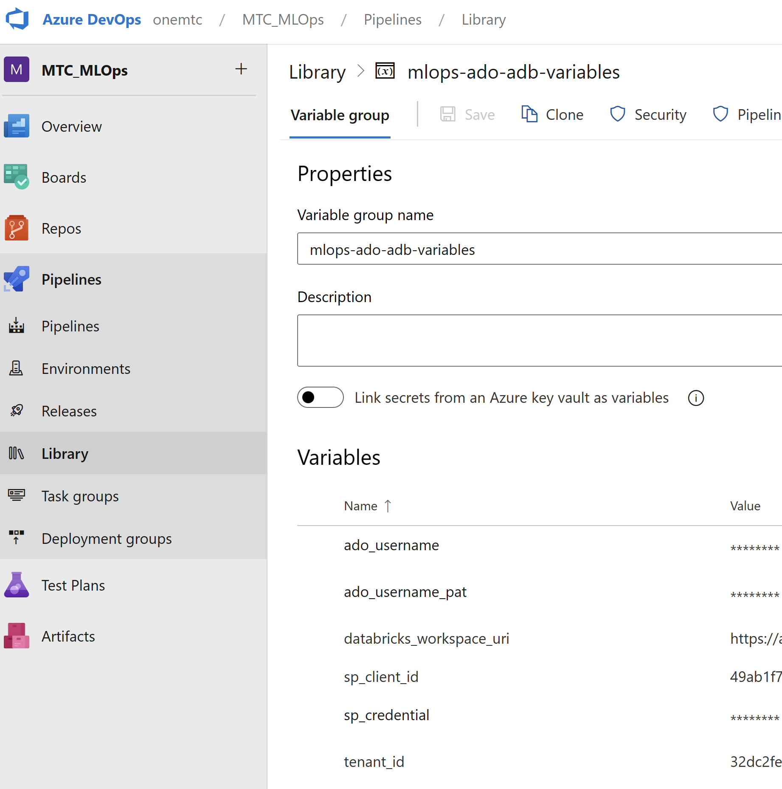
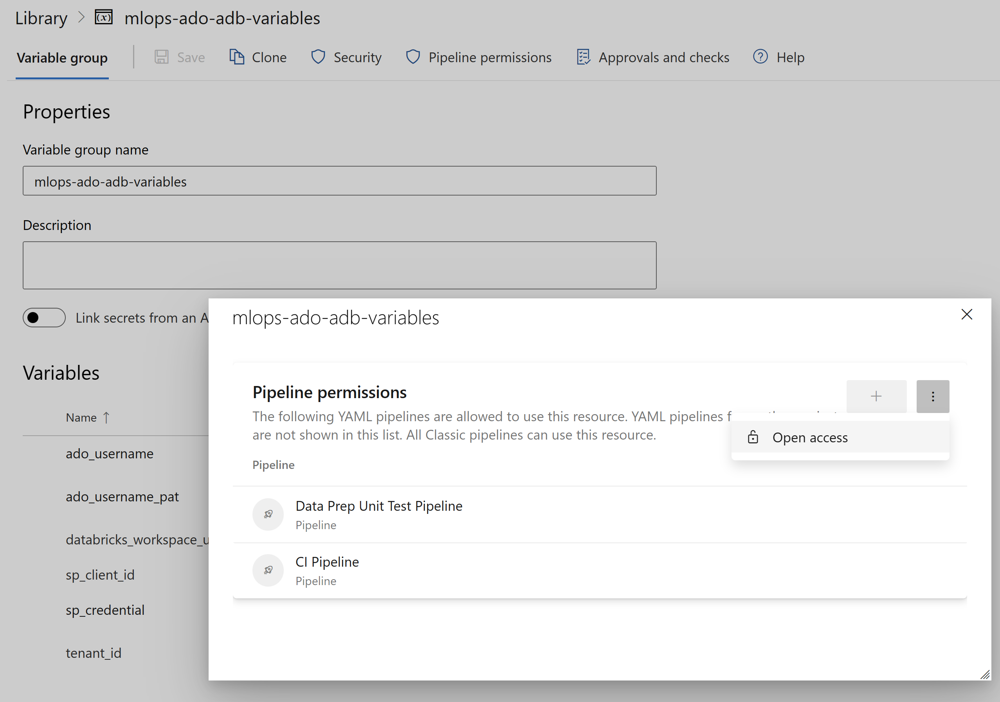
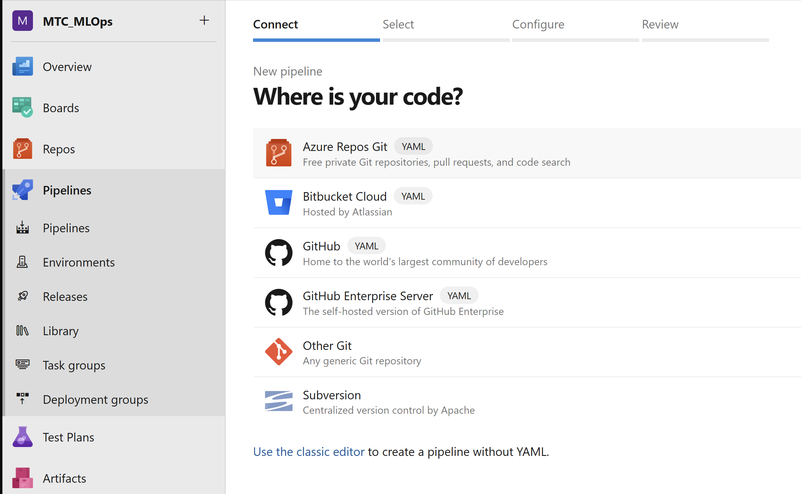
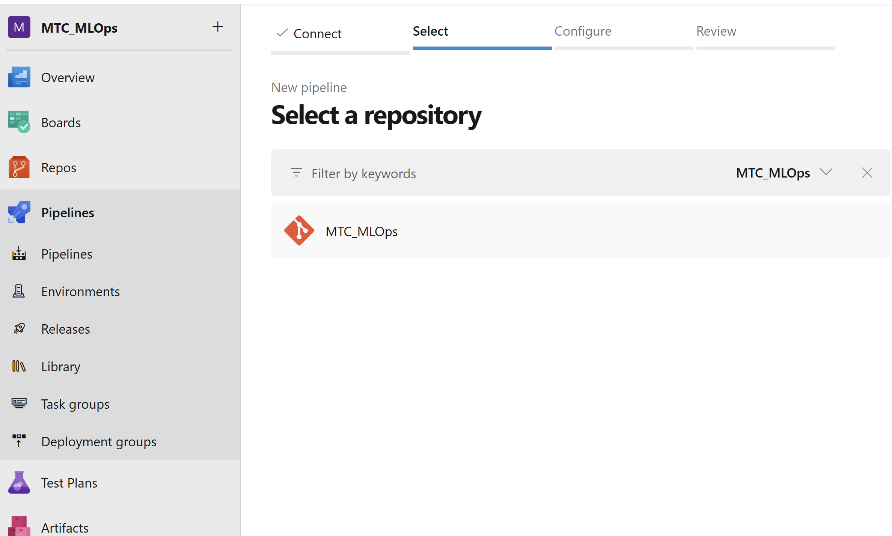
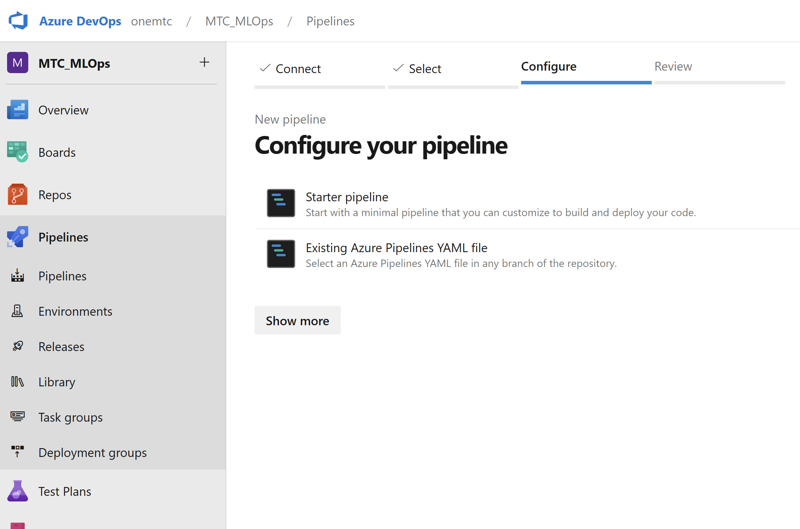
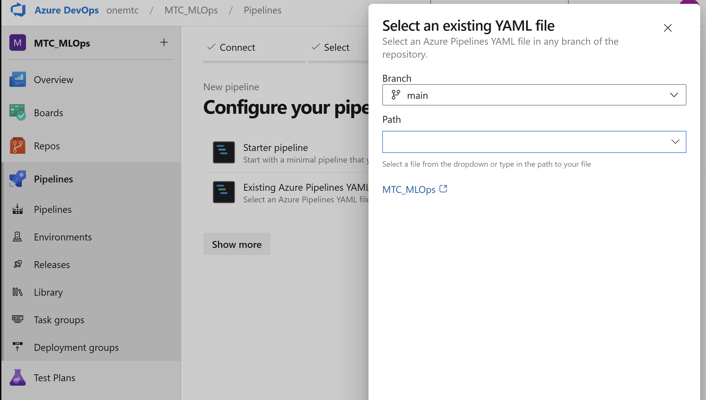
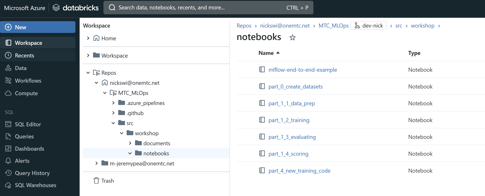
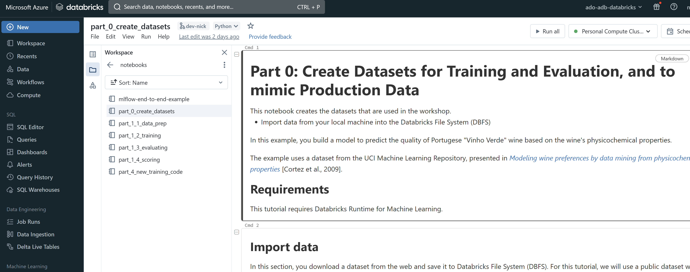

# Part 0: Workshop Environment Setup
> NOTE: The Workshop is designed to take place in a customer environment and requires an Azure AD Service Principal, including the Azure AD token for the Service Principal. Many data science and ML platform teams will need to submit a service request for a Service Principal. Plan in enough time for this service request to be processed.

Read the Workshop scenario overview [here](https://github.com/microsoft/MLOpsTemplate/blob/main/src/workshop/README.md#workshop-scenario).

The steps described here in Part 0 prepare Azure Databricks, Azure DevOps, and an Azure AD Service Principal to serve as the MLOps platform. These steps are to be performed by the platform administrators so that data scientists can start with Part 1 without getting overwhelmed with the infrastructure details involved in getting the core pieces of the MLOps platform linked together.

## Pre-requisites for Part 0
- An Azure Account and Subscription
- Permission to create, or access to, an Azure AD Service Principal
- An understanding of:
    - Azure Subscriptions and Resource Groups
    - Azure AD Service Principals
    - Git mechanics (in this workshop we use Azure Repos and Databricks Repos)

## Steps

1. Create a Service Principal in Azure Active Directory
2. Add the Service Principal to your Azure Databricks workspace
3. Add the Service Principal to Azure DevOps
4. Create a variable group in Azure DevOps
5. Register Azure Pipelines
6. Grant workshop participants Azure DevOps permissions and user access
7. Generate and store data

## 1. Create a Service Principal in Azure Active Directory

> NOTE: You can skip this section if you've been provided an Azure AD Service Principal.

## 2. Add the Service Principal to your Azure Databricks workspace

## 3. Add the Service Principal to Azure DevOps

## 4. Create a variable group in Azure DevOps

Grant open access to pipelines? Or maybe just to the pipelines that are registered.

### 4.1 Choose ADO "utility" user and create PAT (Personal Access Token)

You are going to create a PAT for some "utility" user in the Azure DevOps project to allow your code access the Azure Repo in the Azure DevOps project. (There is a current Databricks limitation in directly granting the Service Principal git credentials with any git provider.)

Use this user for `ado_username` and `ado_username_pat`.

## 5. Register Azure Pipelines

Select `/.azure_pipelines/workshop_unit_test.yml`.

Save.

## 6. Generate and store data

In Databricks, navigate to your Databricks Repo and to the notebook `/src/workshop/notebooks/part_0_create_datasets` and run it.

## [Go to Part 1](part_1.md)
