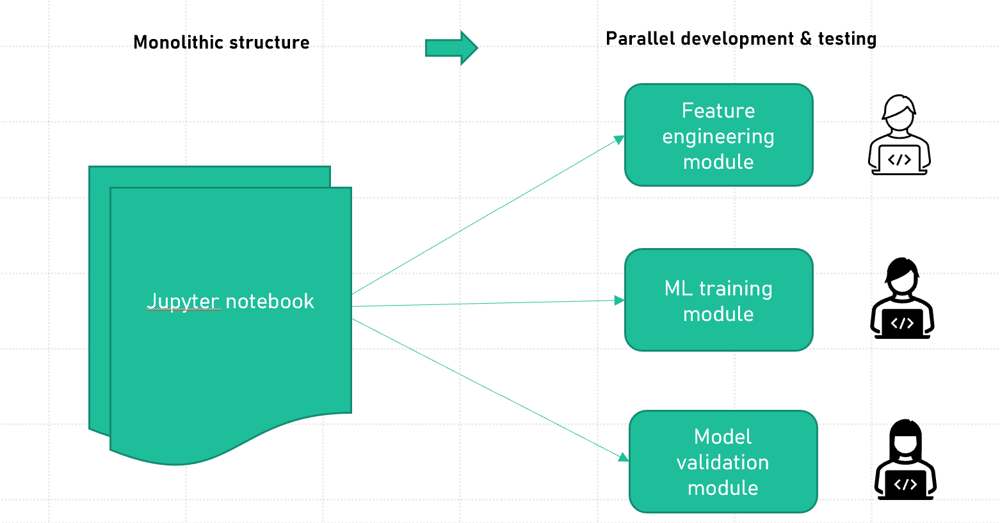
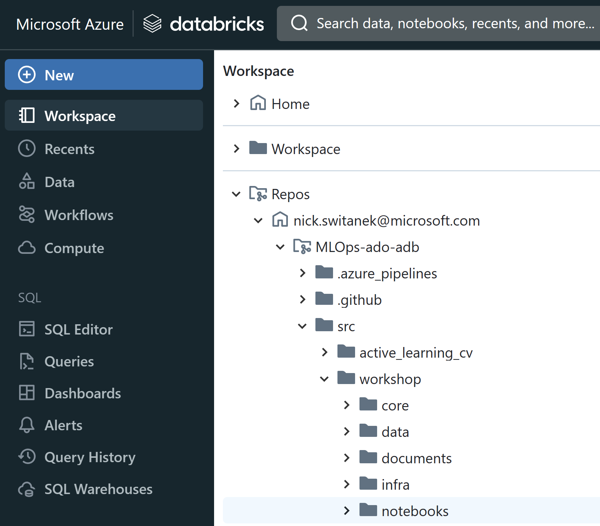
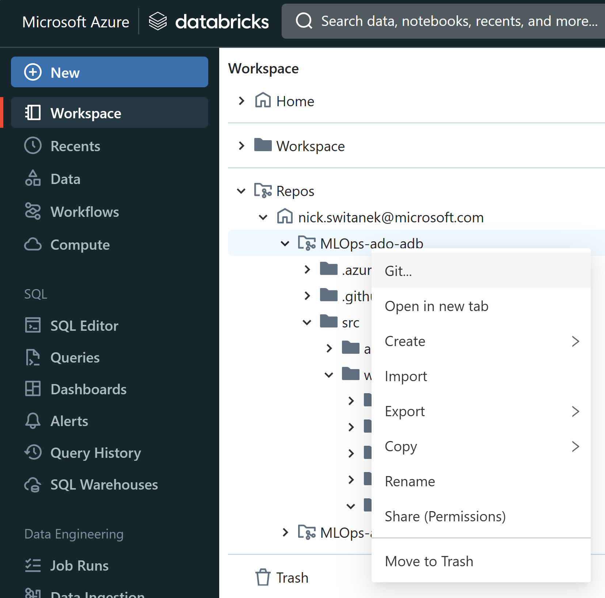
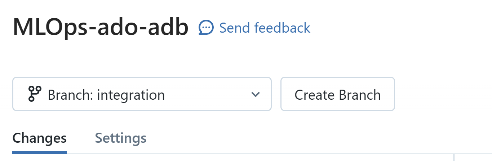
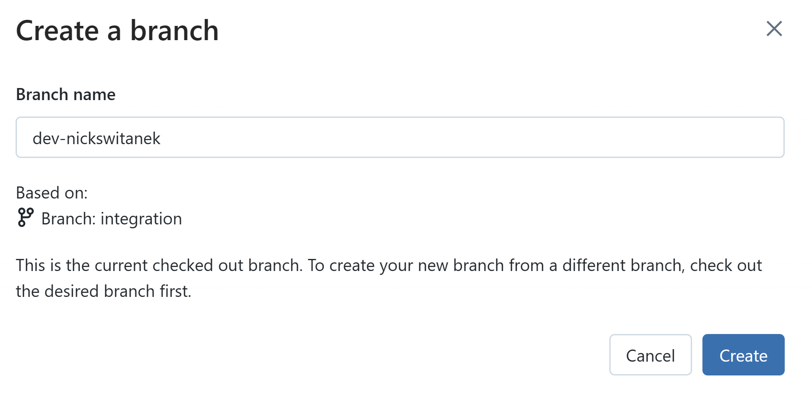
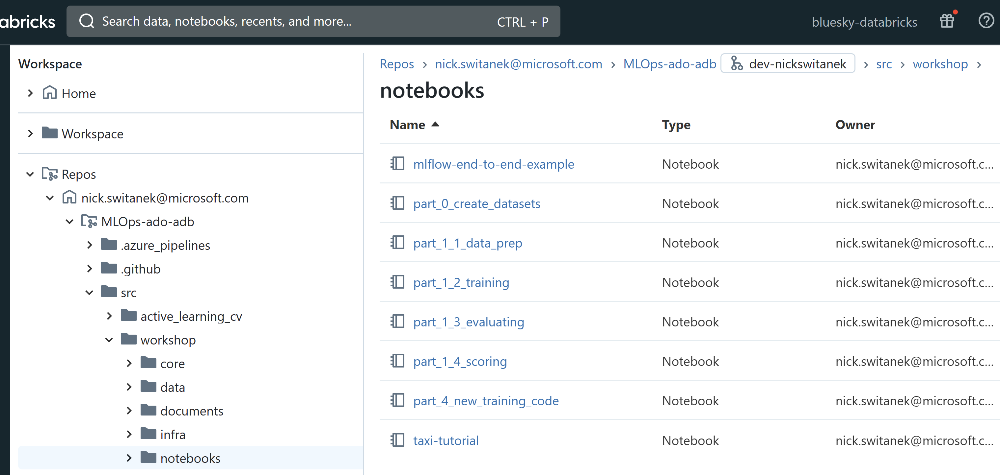

# Part 1: Structure code for fast iterative development
## Pre-requisites
- Complete [Part 0](part_0.md) to set up the required resources and permissions in Azure. 


## Summary 
Your team has been working on a new ML problem. The team has done initial exploratory work preparing the data and fitting models and has now come to a state that the solution direction is mostly solidified. Now, it is time to structure the work so that the team can systematically and quickly iterate towards an improved and deployable solution.   

So far, team members have been working mostly independently in Azure Databricks notebooks that handle their end-to-end model development workflow. To enable more effective collaboration for continuous improvement and easier maintenance of the workflow, they will benefit from breaking the workflow into separately maintainable but linked parts.

As a first step towards MLOps, the team needs to accomplish the following:  

- Modularization: A monolithic Databricks notebook is refactored into smaller, "module" notebooks that focus on a particular stage in the overall model development lifecycle and can be developed and tested independently and in parallel by multiple members.
- Parameterization: The modular notebooks are parameterized so that they be rerun with different parameter values.

To illustrate how the process works, the monolithic notebook was refactored into a feature engineering notebook, a model training notebook, and an evaluation notebook. You will run these modules individually to see how they work.

 

## Steps

> Note: You can review notebooks and run the following tasks in the Databricks Repo in your Azure Databricks workspace. 

0. Navigate to `Repos/{your Databricks user account}/MLOps-ado-adb/src/workshop/notebooks`.




1. Familiarize yourself with the steps in the
  notebook in the Databricks Repo at `/notebooks/mlflow-end-to-end-example.ipynb`. The notebook, developed by Databricks and available in the [Azure Databricks documentation](https://learn.microsoft.com/en-us/azure/databricks/mlflow/end-to-end-example), shows the end-to-end data preparation and model building workflow in a single notebook. **There is no need to run this as part of this workshop.**
   
2. Ask yourself, and discuss with your team, why putting the entire workflow into a single notebook is a challenge to scalable and repeatable ML development.
    > Note: Now observe how the monolithic notebook was refactored into a data prep or feature engineering module, a model training module, and a model evaluation module so that each step in the overall process can be developed and run independently.

3. The basic version control and git branching strategy we'll use is as follows:
- the `main` branch contains all the code used to develop the model in production 
- the `integration` branch starts as a complete copy of `main`
- data scientists create feature branches off of `integration` with names like `dev-myname` to experiment with changes to some part of the workflow, in the hopes of finding an improvement in the models produced by the workflow
- if results are promising, the work done in `dev-myname` is merged into `integration`
- if the new work results in a model that outperforms the production model in `main`, then the new code in `integration` becomes the new `main`, and the model is updated to reflect the new workflow.

4. In your Databricks repo, create your own development branch off of the `integration` branch where you can make and track changes. This branch will be your development area to create and test new code or pipelines before committing or merging the code back into a common branch, such as `integration`.

To do this, right-click the `/MLOps-ado-adb` folder in your Databricks Repos section of your Workspace, and select the "Git..." option from the drop-down menu.



In the next screen, make sure the `integration` branch is selected from the drop-down menu.


Select "Create Branch." In the next screen, type "dev-{yourname}" in the "Branch name" field and "Create" the branch based on "Branch: integration".


After you've created the branch, close the branch window and confirm that `dev-{yourname}` appears in the filepath at the top of the Repos view in Azure Databrcks:


While your dev branch is selected, you'll be looking at version-controlled copies of the files from the integration branch. 

Next let's review those task-focused notebooks that were refactored from the end-to-end monolithic notebook.

5. Review the refactored data preparation logic in the notebook at `/notebooks/part_1_data_prep.ipynb`.

This modular notebook performs the following:

- Loads the raw data from dbfs.
- Checks for missing values.
- Does some basic data visualizations.
- Creates a new, binary outcome variable.
- Saves the prepared data to dbfs.

6. Review the refactored model training logic in the ```part_1_training.ipynb``` notebook under training folder. 

[TODO: determine whether any of the following still hold and can be updated to databricks notebook]

    - The module performs the following:
        - Accepts the following parameters:
            - ```prep_data```: path to a folder for input data. The value for local test run is ```data```
            - ```input_file_name```: name of the input train data file. The value for local test run is ```final_df.parquet```
            - ```model_folder```: path to a output folder to save trained model.The value for local test run is ```data```
        - Splits input train data into train and validation dataset, perform training  
        - Prints out MAPE, R2 and RMSE metrics
        - Writes the train model file to output folder
        > Action Item: Run the following code snippet.
         ```bash 
          python core/training/ml_training.py \
	  --prep_data data \
	  --input_file_name final_df.parquet \
	  --model_folder data

6. Review the refactored model evaluation logic in the ```part_1_evaluation.ipynb``` [TODO: create the notebook that runs the evaluation steps] notebook module under the evaluation folder. 

[TODO: determine whether any of the following still hold and can be updated to databricks notebook]

    - The module performs the following:
        - Accepts the following parameters:
            - ```prep_data```: path to a folder for test input data.The value for local test run is ```data```.
            - ```input_file_name```: name of the input test data file. The value for local test run is  ```test_df.parquet```.
            - ```model_folder```: path to a model folder.The value for local test run is ```data```
        - Loads the model 
        - Scores the model on input test data, print out MAPE, R2 and RMSE metrics
        > Action Item: Run the following code snippet.
         ```bash 
            python core/evaluating/ml_evaluating.py \
	       --prep_data data \
	       --input_file_name test_df.parquet

## Success criteria
- Feature engineering notebook
    - Data is processed correctly and output to a folder as final_df.parquet and test_df.parquet files and ready to be ML trained
- Model training notebook
    - Perform ML training and print out MAPE, R2 and RMSE metrics from input datasets
    - Produce the model at the output location
- Model evaluation notebook
    -  Perform ML training and print out MAPE, R2 and RMSE metrics from an input dataset and output a model file

## Reference materials
- [Databricks Repos]()
- [Parameterizing Databricks Jobs]()

## [Go to Part 2](part_2.md)


