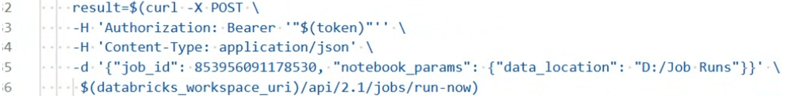
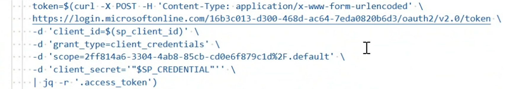
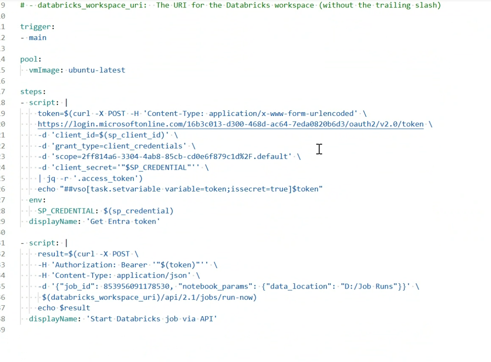
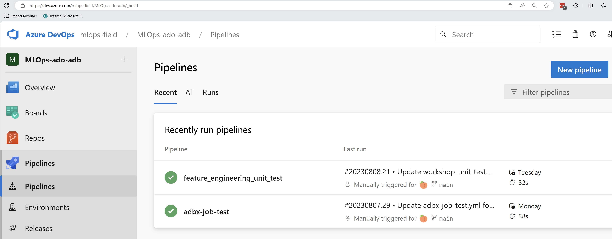
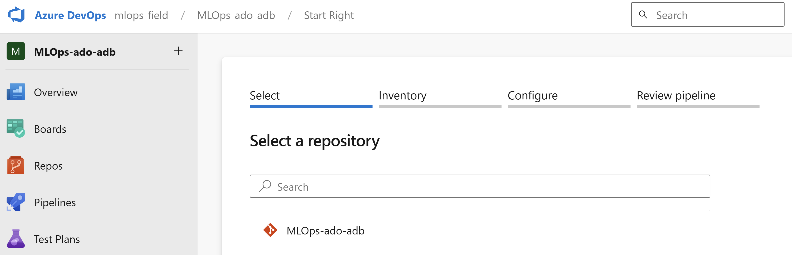
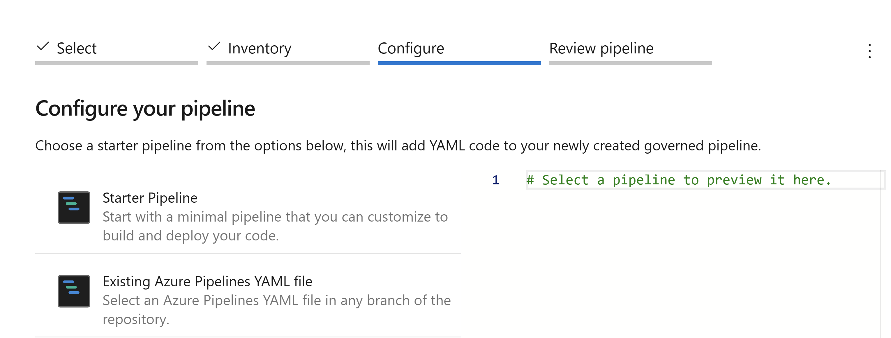
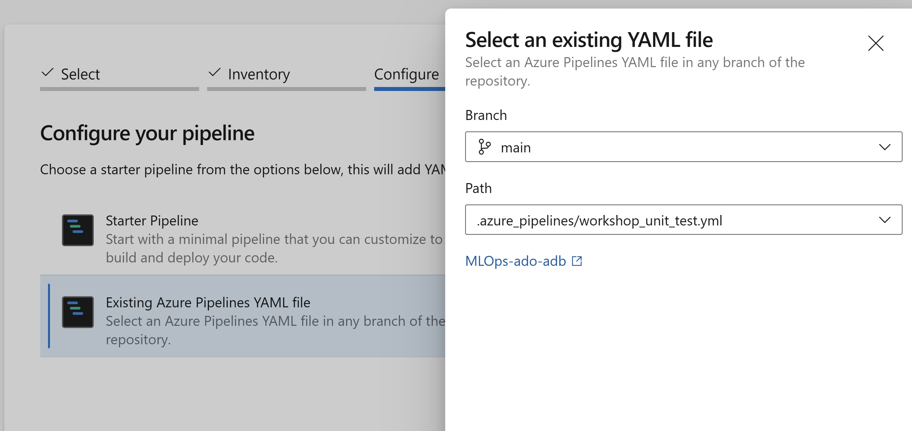
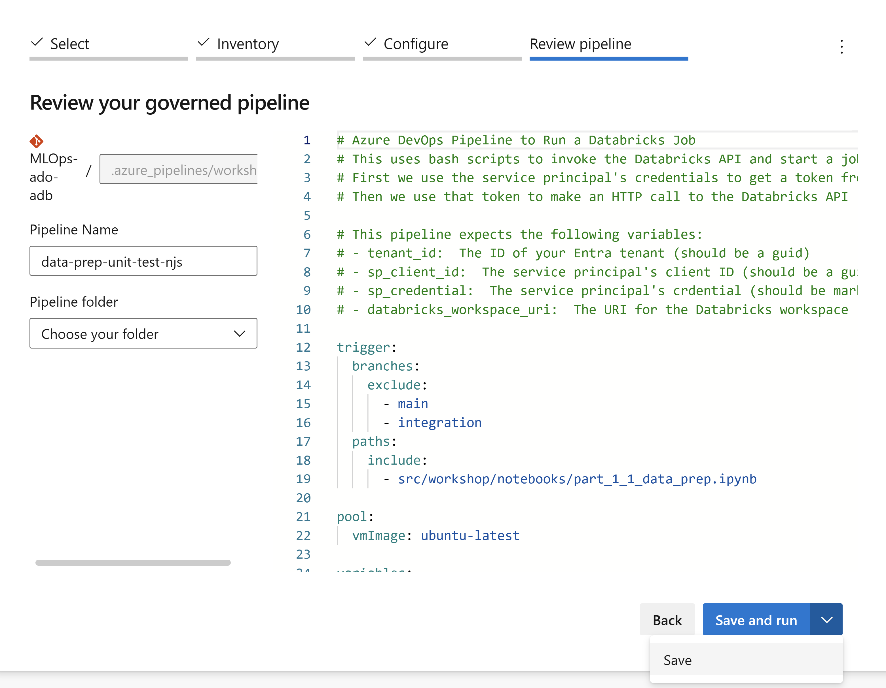
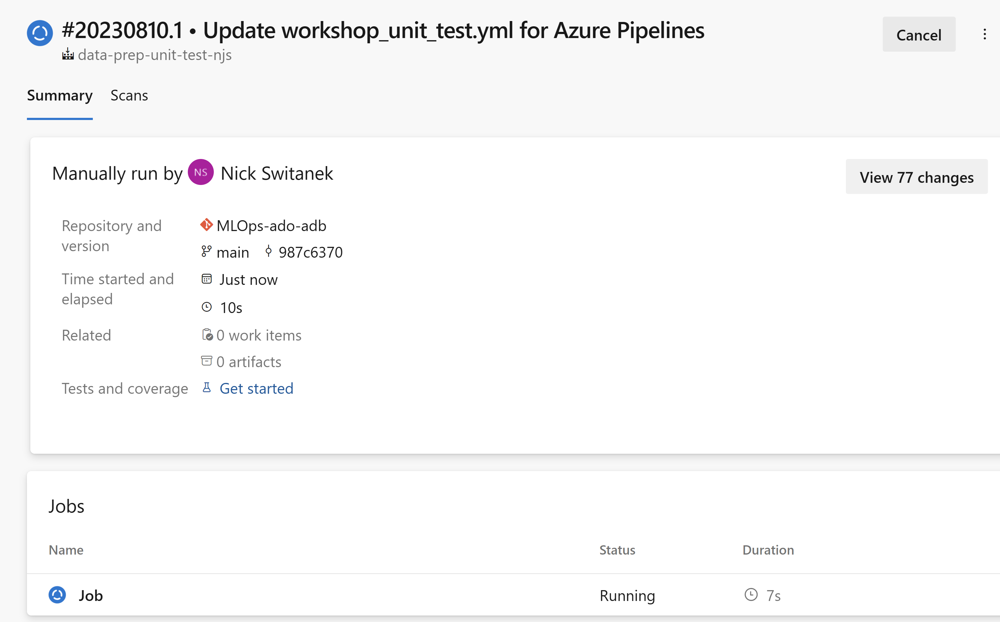
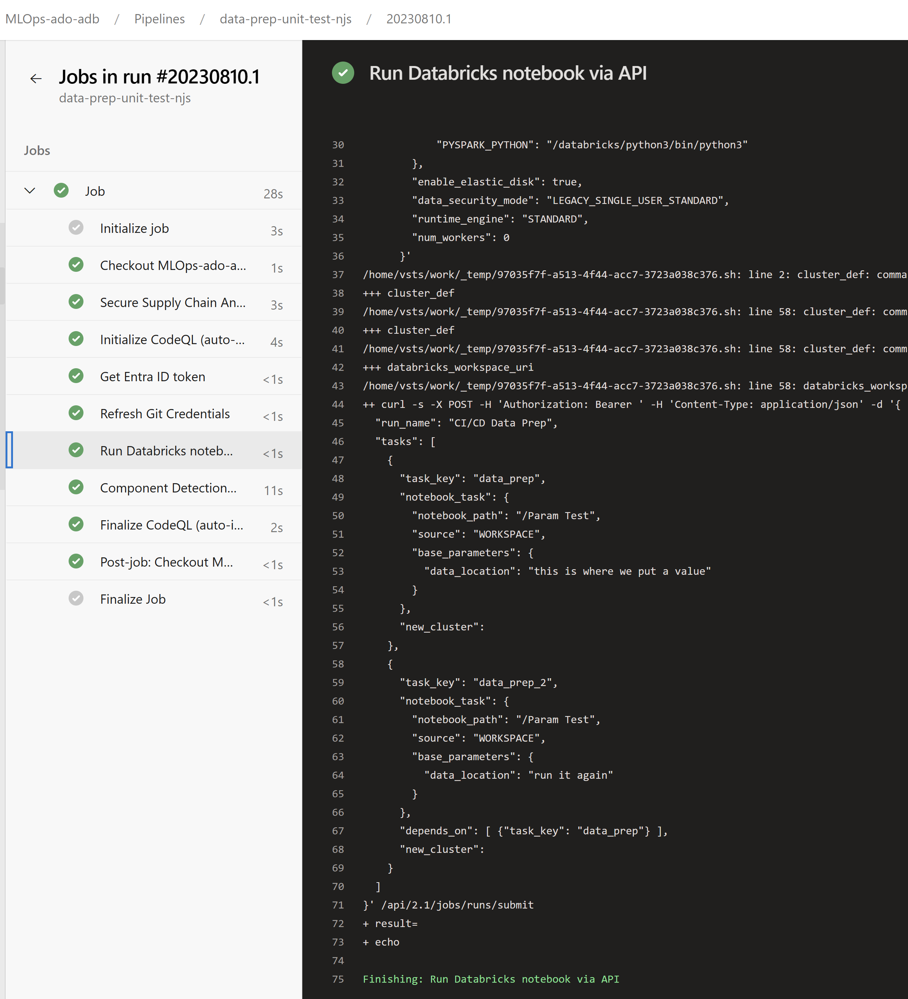

# Part 2:  Preparing notebooks for remote triggering

## Pre-requisites
- Complete [Part 0](part_0.md), [Part 1](part_1.md)
[TODO: make sure the following two bullets are confirmed in Part 0]
- Have access to an Azure AD Service Principal
- Have access to Azure DevOps
- In your Databricks Repo, have personal dev branch off of the `integration` branch. 
- Run each notebook successfully via the Databricks notebook UI -- data prep, training, and evaluating.
- Confirm that you have a Model labeled "Production" in the Models section of Databricks

## Summary 
After successfully restructuring the monolithic Databricks notebook into task-focused, modular notebooks, and running those notebooks via the Databricks UI, your team wants to prepare to run the notebooks automatically in response to code changes.

To do this, we need to move away from untracked, user-driven notebooks to version-controlled notebooks that can be run not by a person but by a Service Principal, which is a type of application with narrowly constrained rights and responsibilities. Your MLOps platform admin should already have created a Service Principal, granted it the appropriate permissions to interact with your Databricks service, and given you permissions to use the Service Principal to run tasks.

To introduce these concepts you will next do the following:
- Preview how to run the data prep notebook via REST API 
- Preview how to use the Service Principal to run the notebook 
- Configure an Azure Pipeline in Azure DevOps to run the notebook using the Service Principal
- Manually trigger the Azure Pipeline from Azure DevOps

## Steps
1. Many actions you take in Databricks, including running a notebook, can be triggered programmatically via API. Let's unpack an example call to the API to run a notebook:
[TODO: update the screenshot, or use code block]

In the first line we see `curl -X POST`, which means we're using a command-line utility, curl, to issue a request to a URL address.
At the bottom we see where the request is sent, to `$(databricks_workspace_uri)/api/2.1/jobs/run-now`. The `$(databricks_workspace_uri)` part is a variable referring to the URI of your Databricks instance, which corresponds to what you can find in the address bar of your browser and is of the form "https://{some string}.azuredatabricks.net/". The API call refers to the notebook to be run.
Many variables used in this pipeline were specified in Part 0 as part of the platform setup, and they are in the Azure DevOps library as a variable group.

[TODO: Incorporate steps to enable the notebooks, in which we had them manually add parameters during testing in Part 1, to also take parameters passed in the API call programmatically.]

After that is the `/api/2.1/jobs/run-now`, which is how we express the command to run the notebook.

2. Next, in order to run a notebook in Databricks you need to have the right permissions. This is what the `Authorization: Bearer '"$(token)"'` is about. Unless we pass the right token along with the API request, the request will be rejected and no action will be taken. From the `$(token)` notation, we see that the token is a variable. How do we get that token? Prior to making the Databricks API request, we're going to request the token for the Service Principal from the Azure AD API.

With this REST call, we are asking Azure AD for an OAuth token for the Service Principal, referred to by its `client_id`. We are passing the `client_secret` for the Service Principal along with the request, and if the request is authorized, we'll get back a JSON message that will include the `access_token` as one of the elements of the JSON, which we use `jq` to parse and extract to the variable `token`. That `token` is what is referenced by `$(token)` in the call to the Databricks API. For security purposes, this token only lives for an hour, so each time we call the API, we'll first have the Service Principal authenticate.

3. We now know that running the notebook via the Databricks API requires first authenticating and getting a token that reflects the right permissions. We'd like these two steps to run on a secure machine in a pipeline that can be automated in response to certain events like code changes that have been saved and committed to our repo. Azure Pipelines is a platform enabling just such functionality. Here is an example Azure Pipeline definition:

In the `steps` section we can see the authentication request followed by the Databricks API request to run a notebook.

These `curl` requests have to be run somewhere, and in the `pool` section we see that Azure Pipelines will run them on a virtual machine running the latest Linux ubuntu OS.

At the top of the pipeline configuration there is a `trigger` section, which is where we'll specify the conditions under which the steps should be executed. We'll do that in Part 3 of the workshop.

4. For now let's manually trigger the Azure Pipeline to confirm it does what we expect. In your browser, navigate to Azure DevOps at https://dev.azure.com. Go to the Pipelines section and select "New pipeline".

Select your MLOps-ado-adb repo.

Configure your pipeline using an "Existing Azure Pipelines YAML file":

Select the `.azure_pipelines/workshop_unit_test.yml` Azure Pipelines YAML file in your branch of the repo.

[TODO: screenshot should not show main]

Give your pipeline a Pipeline Name of "data-prep-unit-test-{yourname}", the click the "Save and run" button to manually trigger the pipeline.

[TODO: revise branches trigger to add an include path and have the user edit the include to point to their dev branch -- otherwise all dev branches will trigger all workshop participants' pipelines]

5. Let's review what happens next. Click on the "Job" link to open up the Azure Pipeline job you just saved and ran.

You'll see a long list of steps that have run on the Linux VM in Azure pipelines. All steps in the Azure Pipeline should show a green checkmark as having successfully completed. Many of the steps are utility steps, but they also include the two steps we explicitly defined in the pipeline YAML, namely the authorization step, labeled "Get Entra ID token" -- Entra is the new brand name for Azure AD --, and the run notebook step, labeled "Run Databricks notebook via API". Click on "Run Databricks notebook via API".

6. Finally, let's confirm that the command we issued to our Databricks workspace from the Azure Pipeline actually triggered the Databricks notebook to run. In your browser, return to Azure Databricks and navigate to Workflows > Job runs. You should see a job with name "Data Prep Pipeline Run - {your branch name}" that was run as your Service Principal.

[TODO: find run triggered via Azure Pipeline and include screenshot]

## Success criteria
- Basic understanding of how to call the Databricks API to run a notebook
- Basic understanding that the Service Principal can execute the API call, if it is authenticated and has the right permissions.
- Basic understanding of how an Azure Pipeline can be configured to automate the sequence of steps for Service Principal authentication followed by Databricks notebook run using the Databricks API
- Review the Azure Pipeline run
- Confirm that the Azure Pipeline ran a notebook job in Azure Databricks

## Reference materials

## [Go to Part 3](part_3.md)
