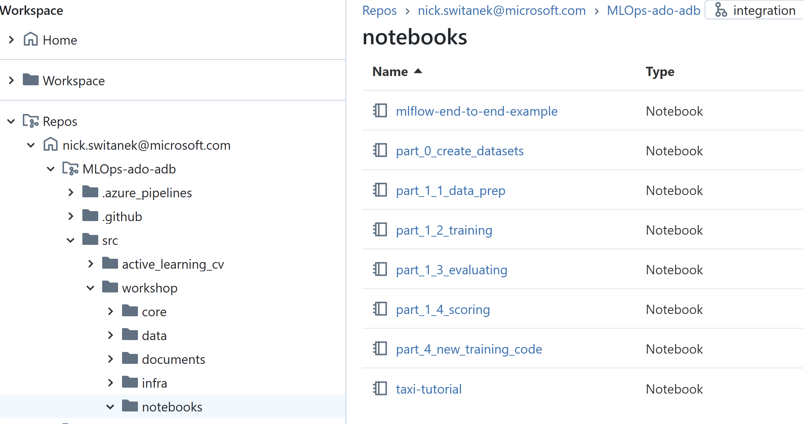
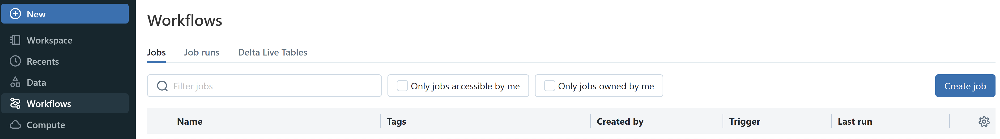
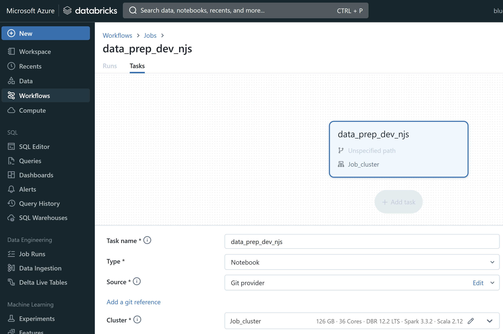
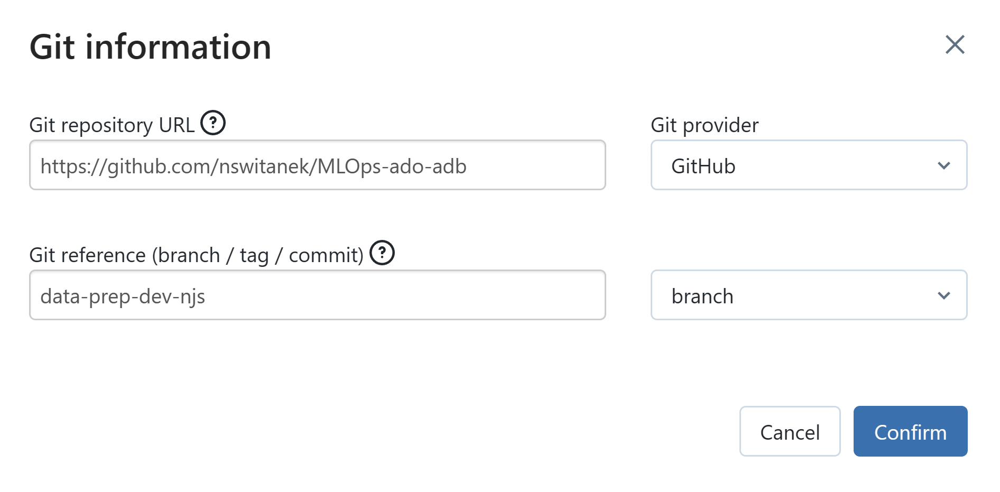
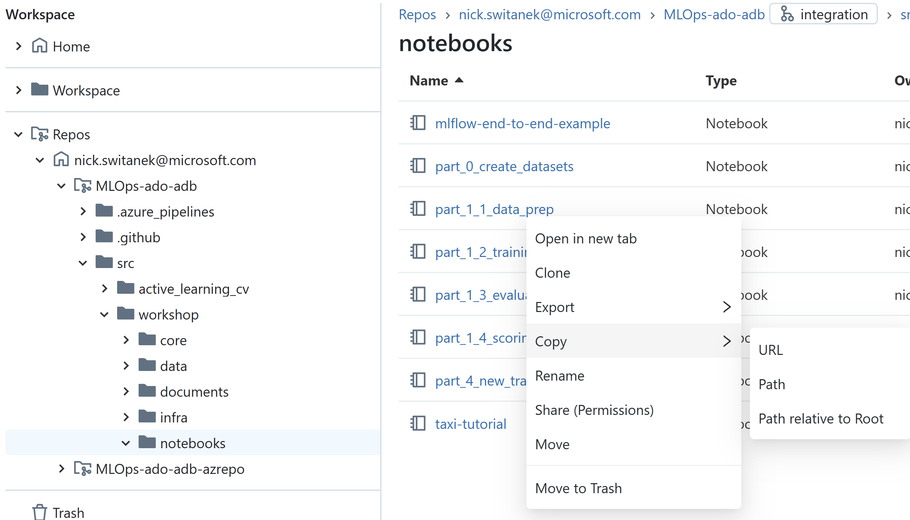
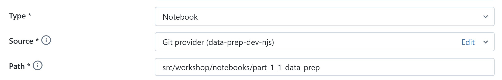
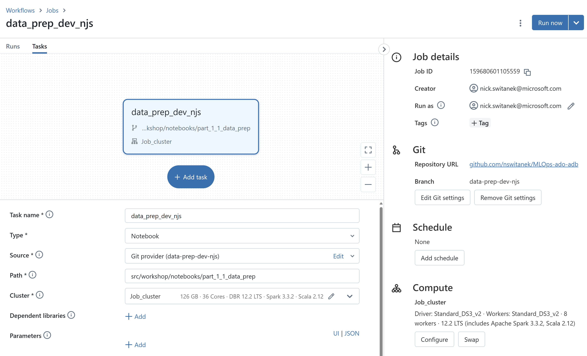
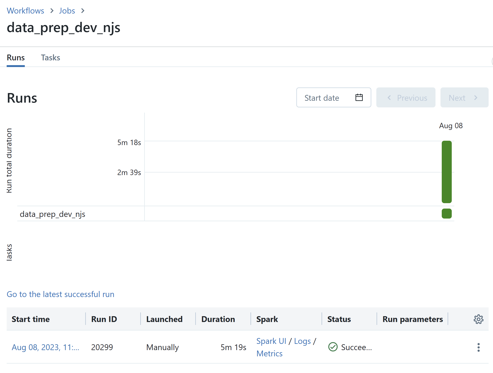
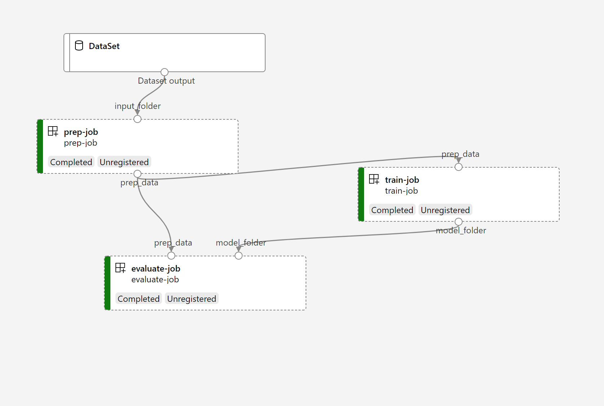

# Part 2:  Preparing notebooks for remote triggering

## Pre-requisites
- Complete [Part 0](part_0.md), [Part 1](part_1.md)
- In your Databricks Repo, have personal dev branch off of the `integration` branch. 
- Run each notebook successfully via the Databricks notebook UI -- data prep, training, and evaluating.
- Confirm that you have a Model labeled "Production" in the Models section of Databricks
- Have access to an Azure AD Service Principal
- Have access to Azure DevOps

## Summary 
After successfully restructuring the monolithic Databricks notebook into task-focused, modular notebooks, and running those modules via the Databricks UI, your team wants to prepare to run the notebooks automatically in response to code changes.

To do this, we need to move away from interactive, user-driven notebooks to jobs that are tied to version-controlled notebooks and can be run not by a person but by a Service Principal, which is a type of application with narrowly constrained rights and responsibilities. Your MLOps platform admin should already have created a Service Principal, granted it the appropriate permissions to interact with your Databricks service, and given you permissions to use the Service Principal to run tasks.

So for each of the three task-focused notebooks (data prep, training, evaluating) you will next perform the following:
- Create a Databricks Job from the notebook, 
- Trigger the Job run manually via the UI, executed as user, then 
- Assign the Job to be executed by the Service Principal, and
- Manually trigger the Job to test execution by Service Principal.

After that, we'll 
- Run the three jobs together as a workflow
- Deploy and test the resulting model [originally: "as an API using Azure Managed Online Endpoint" TODO: determine the deployment pattern and then replace the description as appropriate]


## Steps
1. In your Databricks Repos folder, navigate to the `/workshop` folder, and to the `/notebooks` folder within that. 

[possibly: instructions on navigating to `integration` branch and then create personal dev branch off integration]

You should see a list of notebooks:



2. Open the "part_1_1_data_prep" notebook in Databricks in a new tab in your browser. Briefly review the content of the notebook and the actions it takes. 

3. Now, we're going to create a Databricks Job to execute this notebook. In the sidebar of the Databricks UI, navigate to "Workflows." At the top of the screen you'll see something similar to the following:



Click on the "Create job" button. A job can consist of a single task or multiple tasks, and here you'll create a single-task job to align with our modular approach. 

Name the job and task to reflect the purpose of this job, and gives information about the branch and author. "data_prep_dev_{your_initials}" will work well.


Set the "Source" of the Job to be your "Git provider" rather than the "Workspace," since we want the notebook code to be read by the job from the version-controlled repo, rather than from code that is local to only your Databricks Workspace.

Provide the Git information that specifies your Git repository URL [to be changed to Azure Repo] and the Git reference.

The Git reference will be to your development branch.


To set the Path value, go to your other Databricks tab in your browser where you have your notebook names in your Repo. Right-click on the name of the notebook your Job will run, "part_1_1_data_prep", and choose Copy > Path relative to Root.  


Paste this value into the Path field in the Job creation UI.


Now that you have the Job fully configured, click the "Create" button in the lower right corner of the UI.

4. Manually test the Job you've configured. Click the "Run now" button in the upper right.



Unless your Job cluster is already up and warm, it will take a few minutes for the Job to start running. After about 5-6 minutes, the Job should complete successfully, which you can confirm in the Runs tab associated with the Job:


5. 

Set defaults values to configure your resource group and workspace.
   > Action Item: Run the following code snippet.
    ```bash 
    az configure --defaults group=YOUR_RESOURCE_GROUP workspace=YOUR_WORKSPACE
    ```

3. Run the ```feature_engineering.py``` module under the ```data_engineering``` folder by following the steps below:
   > Action Items:
   > - Run the following code snippet:
      ```bash 
        az ml job create -f core/data_engineering/feature_engineering.yml 
      ```
   > - Go to Azure ML Studio and locate the run detail for this experiment.

4. Run the ```ml_training.py``` module under the ```training``` folder by following the steps below:
   > Action Items:
   > - Run the following code snippet:
      ```bash 
        az ml job create -f core/training/ml_training.yml 
      ```
   > - Go to Azure ML Studio and locate the run detail for this experiment.

5. Run the ```ml_evaluating.py``` module under the ```evaluating``` folder by following the steps below:
   > Action Items: 
   > - Run the following code snippet:

      ```bash 
        az ml job create -f core/evaluating/ml_evaluating.yml 
      ```
   > - Go to Azure ML Studio and locate the run detail for this experiment. Observe the ML metrics and how the model was logged to Azure ML's model registry.

6. Create a pipeline that runs the feature_engineering, training and evaluation in one workflow.
   > Action Items: Run the pipeline, by running the following code snippet.
   
      ```bash 
        az ml job create -f core/pipelines/training_pipeline.yml 
      ```
   > - Go to the run detail at Azure ML studio and observe the relationship graph among the modules. (See chart below as well.)

7. Discuss this question: Why should we run the modules both individually and together in a pipeline? 

8. Deploy to Azure ML Managed Online Endpoint by following the steps below:
   > Action Items:
   > - Update the ```endpoint.yml``` file and ```deployment.yml``` by updating the name of the endpoint (should be a unique name)
   > - Create your endpoint
      ```bash 
        az ml online-endpoint create --file core/scoring/endpoint.yml 
      ```
   > - Create a green deployment 
      ```bash 
        az ml online-deployment create --file core/scoring/deployment.yml 
      ```
   > - Test the deployed service with mock-up data from scoring_test_request.json
      ```bash 
        az ml online-endpoint invoke -n YOUR_ENDPOINT_NAME --deployment green --request-file core/scoring/scoring_test_request.json 
      ``` 
   > - Observe the returned scores from the endpoint evaluation.

### The entire training pipeline is illustrated with this diagram


## Success criteria
- Run the modules individually in Azure 
- Capture metrics and models in ml_training and ml_evaluating modules
- Run three modules together in a pipeline
- Model is deployed successfully to managed endpoint. 
- Testing is successful

## Reference materials
- [Azure ML CLI v2 tutorial](https://docs.microsoft.com/en-us/learn/paths/train-models-azure-machine-learning-cli-v2/)
- [Azure ML CLI single job examples](https://github.com/Azure/azureml-examples/tree/main/cli/jobs/single-step)
- [Azure ML CLI pipeline examples](https://github.com/Azure/azureml-examples/tree/main/cli/jobs/pipelines)
- [Deploy to managed online endpoint](https://docs.microsoft.com/en-us/azure/machine-learning/how-to-deploy-managed-online-endpoints)
- [Deploy to batch endpoint](https://docs.microsoft.com/en-us/azure/machine-learning/how-to-use-batch-endpoint)

## [Go to Part 3](part_3.md)
