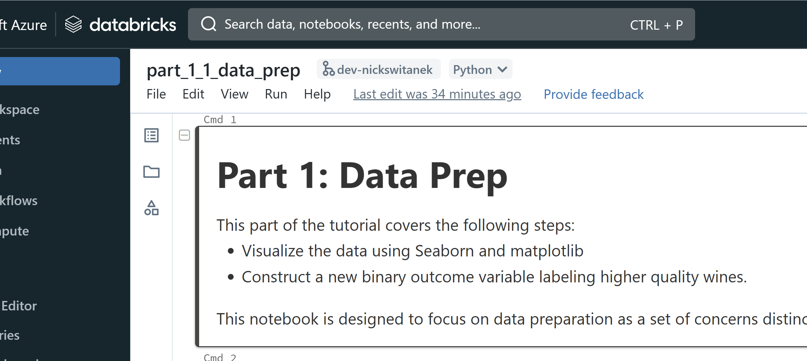
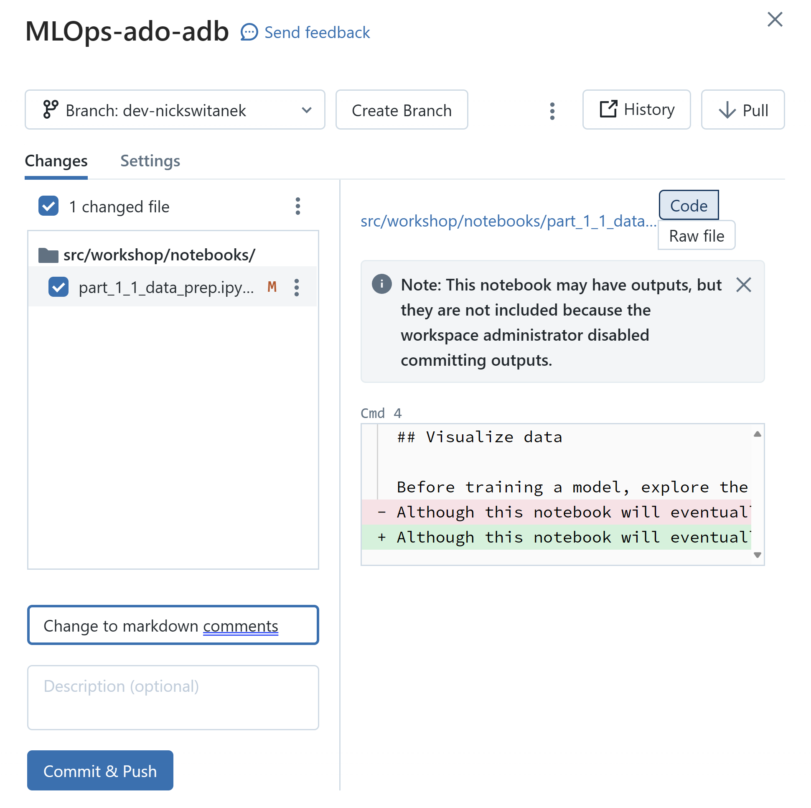
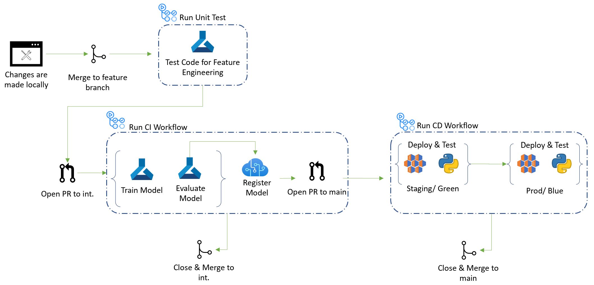

# Part 3: Use Azure DevOps with Databricks Repos for Automation

## Pre-requisites
- Complete [Part 0](part_0.md), [Part 1](part_1.md), [Part 2](part_2.md)

## Summary
Although there are a variety of ways to implement MLOps, the aim is to have a balance between a controlled, secured operational environment that delivers predictions or other services from ML models --this is the "Ops" in MLOps--, together with a way of integrating the innovations and improvements made by data scientists and engineers in the "ML" workflow. 

Version-controlled code that generates the model that is delivering predictions in production needs to be maintained no matter what, so any potential improvements that the data science and engineering teams make cannot disrupt the delivery of predictions. To prevent disruptions and to enable continuous delivery, it's common to require new ideas, committed to code, to pass through several stages of review before replacing parts of what was already in production. 

The basic stages that we'll introduce in this workshop are the following:
- "Unit test": does a notebook that has been changed still run successfully on its own?
- Integration testing: if a notebook has changed, does the overall workflow, composed of several notebooks, still run successfully?
- Model evaluation: if the overall workflow runs successfully, it produces a model, so does that model outperform the model already in production?

Because we want these stages to be required whenever someone proposes changing an element of the existing workflow, and because each stage has several steps that must be performed consistently every time, we make use of an automation tool, Azure Pipelines. 

We want certain steps to be taken every time changes are made to different parts of the code base, in different branches. So we will configure the triggers of Azure Pipelines to watch for changes in the code repo.

In this part, we focus on the "unit test."

You may have noticed in Part 2 that the Azure Pipeline you worked with had "unit test" in the YAML file name. We're putting "unit test" in quotes here, because it's not precisely what a software engineer would call a unit test, but the basic idea is that we want to assess whether a small but meaningful component of the code works as expected on its own, before we move on to trying to integrate it with everything else.

## Steps
1. First, let's review the Azure Pipeline YAML from Part 2 for what triggers the pipeline. In Azure DevOps, navigate to Azure Pipelines, click on the pipeline you triggered manually in Part 2, and click on the "Edit" button in the upper right. This will give you a way of viewing the pipeline YAML file. You can also navigate to this file in the Repos section of Azure DevOps, by clicking on Repos and into the /.azure_pipelines directory, then clicking on the workshop_unit_test.yml.

[TODO: update this screenshot with current yml file]

We can see in the YAML configuring the Azure Pipeline that there are `branches` and `paths` triggers. The `branches` triggers state that any code changes committed to a branch that is not ("exclude") the `main` or `integration` branch and is on ("include") your personal dev branch, will trigger the pipeline. We only need the "include" branch trigger condition in this case, but when you are out of the workshop, you'll commonly encounter the condition to unit test every code change not on main or integration. 

Recall that `integration` starts as a copy of main, and that any new data science or engineering work should be done on a branch that is made off of `integration`. In Part 1, you created a development branch in your Databricks Repo named something like `dev-{yourname}`. Next, the `paths` triggers tell Azure Pipelines to observe changes to a particular file path, in this case the path to the data prep notebook. 

This trigger configuration then has Azure Pipelines watching your data prep notebook on branches like your development branch, and will run this automated set of tests when you commit the changes you make to your notebook, just to make sure that the notebook still runs successfully. 
> Note: One could incorporate other tests at this stage, but for simplicity in demonstrating the basic concept, we focus here only on the notebook running successfully.

2. Next, now that we know which committed changes to which notebooks on which git branches should trigger this Azure pipeline, let's see if changes we make to the data prep notebook actually do trigger the unit test pipeline. In Databricks, navigate to your Workspace > Repos and to the MLOps-ado-adb folder. Confirm that you are on your dev branch, likely named `dev-{yourname}`.

In the Databricks Repo, open the `/notebooks/part_1_1_data_prep` Databricks notebook. Make any minor change to the notebook. This can be a change simply to the markdown comments, or something in the code cells that won't stop the notebook from running from top to bottom. You can manually `Run all` to confirm that your changes don't cause the notebook to raise an exception before completing.

3. Changes you make in a Databricks notebook automatically save to the Workspace, but are not automatically reflected in the Azure Repo that the Databricks Repo is linked to. In order to sync the Databricks Repo with the Azure Repo, you need to execute two git actions, you need to `commit` the code changes and `push` the changes to the Azure repo. To do this from your Databricks Repo, you can click on the git icon with your branch name at the top of your Databricks notebook. In this example the branch is named `dev-{yourname}`:

Next, you are in the Databricks Repo interface, where you must first enter a "Commit message", and then you can select "Commit & Push" to commit the changes and push them to the Azure Repo.

Next, let's trace out the consequences of your code commit and push. 

4. First, in Azure DevOps navigate to the Azure Repo and to the notebook file you changed to see that the changes you committed are reflected in the history of the file.

[TODO: collect screenshot]

5. Next, the Azure Pipeline trigger conditions that we reviewed in step 1 seem to be satisfied by the changes we just committed to the Azure Repo: we changed the file on the watched path in a branch that is neither `main` nor `integration`. So did we trigger the Azure Pipeline? In Azure DevOps, navigate to your Pipelines. In the "Recently run pipelines" list, can you find the relevant pipeline "data-prep-unit-test-{yourname}" and does the "Last run" correspond to your commit and push?

Importantly, did the pipeline successfully run to completion? There will be a solid green circle with a checkmark in it if it did.

6. Finally, the Azure Pipeline uses a Service Principal with notebook run privileges on your Databricks workspace to run the Databricks notebook that you changed. Back in Azure Databricks, navigate to the Job Runs section to see whether the notebook you changed was run by the Service Principal, as expected.

## Conclusion
The "unit test" described here is a basic introduction to how all the key pieces in an MLOps implementation fit together. 

- A data scientist or data engineer creates a dev branch off of `integration`, where they make changes to Databricks notebooks in the Databricks Repo that are designed to improve the overall flow in some way
- Once the changes made in the Databricks Repo are deemed ready for potential inclusion in the production code in `main`, the changes are committed and pushed to the Azure Repo in Azure DevOps
- An Azure Pipeline in Azure DevOps is configured to watch for file changes in certain branches, and an automated set of steps are triggered by the commit to the Azure Repo
- The Azure Pipeline authenticates the Azure Service Principal and enables the Service Principal to run the notebook via the Databricks API

If the unit test Azure Pipeline runs successfully, then we think the code changes in the one notebook are ready to be tested in the context of the full workflow consisting of multiple Databricks notebooks. Testing in the context of the full workflow is known as integration testing, and is the focus of Part 4.

The overall CI/CD Workflow is shown below. We focused in this part on "Run Unit Test".

[TODO: replace image with one using ADB instead of AML]

## Success criteria
- You made a (minor) change to the data prep Databricks notebook in your dev branch in your Databricks Repo
- You committed and pushed the changes from the Databricks Repo, and the changes were reflected in the Azure Repo
- Your commit to the Azure Repo triggered the relevant Azure Pipeline
- The pipeline triggered the Databricks notebook run
- The databricks notebook ran to completion successfully, providing evidence that whatever other effects the changes may have had, they haven't introduced changes that stop the notebook from running to completion

## Reference materials

## [Go to Part 4](part_4.md)
