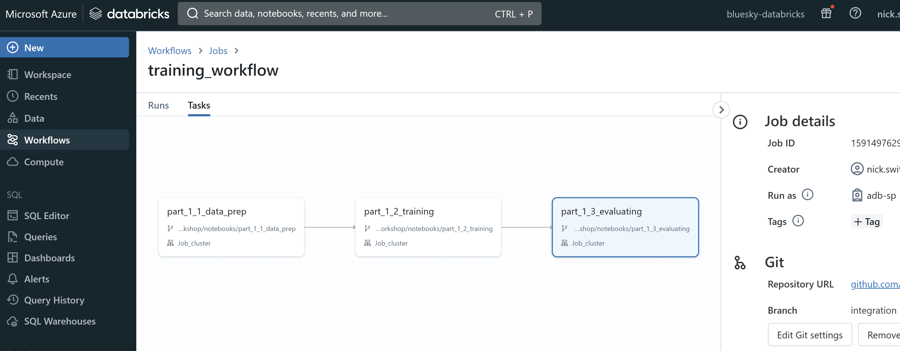

# Part 4: Continuous Integration (CI)

## Pre-requisites
- Complete [Part 0](part_0.md), [Part 1](part_1.md), [Part 2](part_2.md), [Part 3](part_3.md)

## Summary
After successfully using Azure Pipelines to automate unit testing of changes made to an individual notebook that represents a step in the overall model development workflow, your team wants to test that the changed notebook also integrates with the overall workflow. Continuous Integration (CI) is the process of developing, testing, integrating, and evaluating new features in a staging environment, as a way of confirming they are ready for deployment and release. 


## Steps:
1. The notebook that was unit tested in Part 3 is also part of an overall end to end workflow. Navigate to Databricks Workflows and find the `training_workflow` among the Workflow jobs listed. 

Note that the workflow links the three modular notebooks into a sequence of steps that depend on the success of prior steps, and that the notebooks reflect the code committed to the `integration` branch of the Azure Repo. So if we want to test whether the new code in a notebook integrates with the other pieces of this workflow, the new code will need to make its way in `integration`.

[TODO: replace github with azure repo; learn how to specify the databricks workflow in code]


2. The logic of integration testing is that the entire Databricks training workflow should be triggered if the new code has passed unit testing and been merged into the `integration` branch. Let's set the Azure Pipeline triggers to watch for an approved merge into `integration`.

```
# .azure_pipelines/workshop_ci.yml


## this part is the github actions example ##
on:
  workflow_dispatch:
  pull_request:
    types:
      - closed
    branches: 
    - integration
    paths:
      - src/workshop/core/**
      - .github/workflows/workshop_ci.yml


## translating to azure pipelines triggers is not straightforward ##
trigger:
  branches:
    - integration
  paths:
    include:
      - src/workshop/notebooks/**
      - .azure_pipelines/workshop_unit_test.yml

# OR
# maybe use pipeline trigger - include PR to integration as step in unit test pipeline
# then PR merge to integration ends the unit test pipeline and triggers
resources:
  pipelines:
  - pipeline: securitylib # Name of the pipeline resource. workshop_unit_test?
    source: security-lib-ci # The name of the pipeline referenced by this pipeline resource.
    trigger: true # Run workshop-ci pipeline when any run of workshop-unit-test completes

# remainder of the Azure Pipeline config for CI

```

With the Azure Pipeline thus configured for CI, now if the unit test passed on notebook code change, then to get that code into the `integration` branch we need to execute a Pull PR to merge dev branch into integration. And if the PR is merged to the `integration` branch, the continuous integration (CI) Pipeline will automatically run the Databricks workflow job that includes an evaluation step.

3. Now that we have the CI pipeline configured, let's make a meaningful change to the training notebook. Remember from Part 1 that the evaluation notebook will exit if the model trained by the Databricks training workflow doesn't outperform the current model in production when compared on test data. If the evaluation notebook exits, then the workflow will not complete and the CI pipeline will fail, as is desired. So let's update the training notebook to include a technique likely to outperform the baseline model, namely hyperparameter search.

Navigate to your Databricks Repo, to `/notebooks/part_1_2_training`. Make sure you are on the development branch you created in Part 1. In the `/notebooks` folder you'll find some sample code for hyperparameter search and model selection in `/notebooks/part_4_new_training_code`. Copy this code into the model training cell in the original `part_1_2_training`.

4. Once you're sure the edited notebook will run, Commit and Push your changes from the Databricks Repo to Azure Repo, using the steps you practiced in Part 3. 

> Question: Will your commit and push trigger the unit test Azure Pipeline? Why or why not? Is this desirable or not? How could you improve the situation?

5. Now you've pushed the code to the Azure Repo, but it's still on your dev branch. To trigger the CI pipeline, you need to make a pull request (PR) from your personal dev branch, which is named something like `dev-{yourname}`,  to the `integration` branch. Pull Request management is not currently supported in Databricks Repos, so you'll need to go to the Azure Repo in Azure DevOps to make a PR.

[TODO: provide step by step instructions with screenshots]
--- old text ---
At this point you have made some changes to your code and have pushed the changes to your branch on the repository. In order for us to make these changes permanent and take it eventually to deployment and production, we need to place these changes in the "integration" branch.

    >Action Items:
    >- Go to your browser and go to your repository. 
    >- Click on "pull requests" tab and Click on "New pull request". 
    >
    >- Set the `base` branch to `integration` and the `compare` branch to `yourname-dev`.
    >- IMPORTANT NOTE: Make sure the integration branch you choose as the base is pointing to your `forked` repository and NOT the Microsoft MLOpsTemplate repository.
    >- Click on "Create pull request".

6. Merge the pull request into integration to trigger CI pipeline. (Self-merge of PRs to integration allowed by branch protection rules)

[TODO: provide step by step instructions with screenshots]
--- old text ---
    >- Click on "Merge pull request".

    This creates a pull request to the integration branch and merges it. As a reminder, integration branch is a branch which is as up to date as the main branch but we use it to evaluate the new feature. Here we made some changes to the model, and we want to make sure the new model passes the evaluation. If not, it will stop us from going to the CD process and making changes to the main branch where our production code lives.

The merge to the integration branch triggers the workshop_ci workflow. Click on the Actions tab on your repository and you will see CI workflow running after a few minutes. Click and examine all the steps, note that the CI Workflow is running the steps in the ```workshop_ci.yml``` file, which you located earlier. Note that in the first few lines of this file we have defined the workflow to be triggered when a pull request is merged in the "integration" branch.

    The CI workflow has multiple steps, including setting up python version, installing libraries needed, logging in to Azure and running the training model pipeline and evaluating the model. As a part of this workflow, the updated model from our current changes is compared to our best previous model and if it performs better it passes the evaluation step (more details below).

    You can check out different steps of the training pipeline under: ```/src/workshop/pipelines/training_pipeline.yml```. 
    
    >Note: At this point, it takes about 10 minutes for the pipeline to run.
    
    If all steps pass (you can check the status under the actions in the repository), a new pull request is made to the main branch. If the workflow fails, there could be a few different reasons, you can open the workflow steps on the actions tab of the repository and examine it. Most likely if it fails in this case is due to the evaluation part, where our new model performs worse than our best previous model and doesn't pass the evaluation step and the whole workflow fails. To resolve that please read the optional reading section at the bottom of this page.

    >Note: By design the CI workflow will fail if the new updated model does not perform better than our best previous model and that is expected. The CI workflow prevents promoting a new model that does not pass the evaluation step. 


> IMPORTANT NOTE: On success on the CI workflow, a Pull Request (PR) to main is created from the integration branch. This is by design as per the definition of the CI workflow (see last step in the workflow yml file).


7. Confirm that Azure Pipelines CI pipeline triggers Databricks workflow job.

[TODO: provide step by step instructions with screenshots]

8. If workflow completes successfully, and the model evaluation step shows improvement, then model is registered and promoted to "Staging" slot in model registry. Navigate to the Models tab in Databricks to see if a new model has replaced the baseline model in the Production slot.

[TODO: provide step by step instructions with screenshots]

--- old text ---
> OPTIONAL READING: For the evaluation and comparison of the current model with our best previous model, we have included some code in the following script: ```/src/workshop/core/evaluating/ml_evaluating.py```. Note that on line 85 of the script we are comparing the R-square of the current model with our best previous model in order to decide if we want to allow any changes to the model and main branch. You might want to edit this and relax it a little bit in order for the evaluation step to pass if you already have a really good model registered. Note that you can change the evaluation metrics based on your actual use case in the future.


9. If your new model training code passed the integration testing (and the unit testing before that), then it seems likely you've made an improvement to the model training workflow and the new workflow should be replace the old one reflected in the `main` branch. In Part 5, we'll establish a continuous deployment (CD) Azure Pipeline and set up appropriate triggers to automate and manage the promotion of the new workflow to the production, `main` branch.

--- old text ---
> What you will notice will happen, is that another workflow, the CD workflow, is triggered (you could go to 'Actions' in github and see that 'workshop-cd' appeared and is running). We will cover this workflow in the next section. Its trigger is based on having a Pull Request open to main, which is how we automate the CI -> CD chain.
>
> <u>At this point the CD workflow will fail, and this is expected</u>, because we haven't configured it yet (the yaml at this point is incorrect and pointing to incorrect Azure resources for instance).
>
> Another important observation: if you go to the Pull Request, you can see that you'd be allowed to merge the Pull Request to main, even though 'workshop-cd' fails. <u>DO NOT MERGE IT</u>, instead <u>CLOSE IT</u>, but observe that it is inappropriate to have the option to close the PR.
>
>We definitely do not want to allow moving some code to 'main' if something in the integration branch is broken (at this point, the workflow itself is broken, but it could be anything, like the scoring script). Take note of that, as we will setup in the next section a <u>branch protection system</u> that will prevent such a merge to be possible unless the CD workflow is succesful.


## Success criteria
- Trigger CI workflow when a pull request is merged to the integration branch
- Successfully run the CI pipeline which also runs the Databricks end-to-end workflow
- Create a Pull Request to the main branch if new code results in higher performing model

## Reference materials

## [Go to Part 5](part_5.md)

