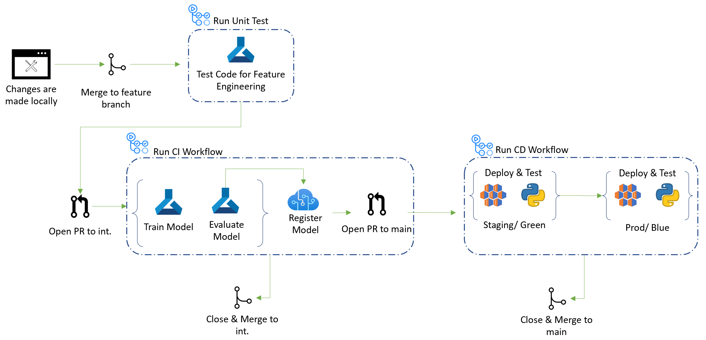

# Part 5: Continuous Delivery (CD)

## Pre-requisites
- Complete [Part 0](part_0.md), [Part 1](part_1.md), [Part 2](part_2.md), [Part 3](part_3.md) and [Part 4](part_4.md)

## Summary 

After a successful run of the CI (continuous integration) pipeline, your team is looking to complete the process with a CD (continuous delivery, or continuous deployment) pipeline that will handle the deployment of the new, better-performing model while maintaining continuous delivery of the model to processes that depend on the model's availability, without introducing any downtime in production, also known as a "hot swap".

The goal of this section is to get a fully functional CD pipeline running that will:
    
1. Authenticates using a Service Principal to be able to leverage the Azure Databricks commands in your workflow.
2. Be automatically triggered based on a Pull Request (PR) that is approved to merge the new code that passes the integration tests in the `integration` branch into the main branch of the repo.
3. If the model performance metrics show improvement over the current production model, then promote the new model to production and demote the old to staging.
4. Confirm that a Branch Protection rule is established in Azure DevOps to ensure that changes to `main` meet certain predefined criteria.

Finally, we will test the new model with sample production data.


For reference, the overall CI/CD Workflow is shown below. In this part, we focus on running the CD Workflow.

[TODO: replace image with one using ADB instead of AML]



## Steps

1. As you have done since Part 3, you define triggers as part of a Azure Pipelines workflow. From the workflow diagram, we see that the CD workflow is triggered when a pull request is created or opened to merge the new code in `integration` into the `main` branch. The PR to `main` is opened automatically if the new code results in a model that outperforms the prior model on test data. So the design of this pipeline trigger is intended to make the CD pipeline automatically follow a successful CI pipeline. The triggers for this workshop have already been defined in `.azure_pipelines/workflows/cd.yml`. 

The key elements of the trigger section are as follows:

```
# .azure_pipelines/workflows/cd.yml

# sample ADO def, needs review and revision
trigger:
  branches:
    include:
    - dev
  paths:
    include:
    - src/scoring

# original GHA def
on:
  workflow_dispatch:
  pull_request:
    types:
      - opened
    branches: 
    - main
    paths:
      - src/workshop/core/**
      - .github/workflows/workshop_cd.yml

```

- 'pull_request': defines the trigger to kick in when an integration is open to main, and a specific set of files have been modified in the pull request (any code change, or CD definition change that would justify pushing a new deployment live). 
To define pipelines that are triggered by the completion of other pipelines, see [Pipeline Triggers](https://learn.microsoft.com/en-us/azure/devops/pipelines/process/pipeline-triggers?view=azure-devops).

2. The CD workflow relies on the Azure CLI to control the infrastructure and implement the automation of the model deployments. Therefore, we need to setup this workflow to login to Azure via a Service Principal to be able to leverage the Azure CLI.

    > Action Items:
    > 1. Open up the `cd.yml` file in your Azure repo under `.azure_pipelines/`.
    > 2. Update the 'creds: ${{ secrets...' section in this file to setup your secret name. Follow the instructions in this file annotated with #setup.

    > Note: Please refer to [Use the Azure login action with a service principal secret](https://docs.microsoft.com/en-us/azure/developer/github/connect-from-azure?tabs=azure-portal%2Cwindows#use-the-azure-login-action-with-a-service-principal-secret) to create the proper Azure Credentials if you haven't done so already (you should have already defined such secret to complete the CI part of the workshop, i.e. [Part 4](part_4.md)).

3. In our scenario, a model is deployed to production when it occupies the "Production" model slot in the model registry. Our CD pipeline needs to ensure that the current best model is always available in the "Production" slot. The Azure Pipeline we specify for CD automates these deployments.

Now let's configure the Azure Pipelines configuration file that controls the CD process located at `.azure_pipelines/cd.yml`

> Action Item:
>- Edit `cd.yml` to setup your Azure resource group name and Azure ML workspace name which are being passed as parameters to a set of custom GitHub Actions. Look for #setup and follow the instructions in the file.

> Action Items:
> 1. Commit your configuration changes and push them up to the Azure Repo in your own development branch. 
> 2. Go to the Azure Pipelines UI, select the pipeline you configured in 'cd.yml', and trigger it to run now on your own branch.
> 3. Once triggered, click on it to open up the details and monitor its execution.


4. The last step to control CD is to set up a branch protection rule to require a succesful CD run to be able to merge any code into 'main'. This important point guarantees that the `main` branch only accepts stable code and the model assets produced by that code, so that the code in `main` always reflects the code required to produce the model actually in production.

Azure Repos provide a way to define such a policy:

> Action Items:
> - Go to your Azure Repo, and click on 'Settings'

[TODO: update the following rules from GHA to ADO]
> - Click on 'Branches' under 'Code and automation'
> - Click on 'Add rule' next to the 'Branch protection rules' to create a new rule, keep all defaults and set the following:
>     - Branch name pattern: main
>     - Require a pull request before merging: CHECK
>     - Require status checks to pass before merging: CHECK
>     - Status checks that are required: type-in 'Workshop-Deployment' in the search box and select it (it should auto-complete). This name is the job name defined in the cd.yml file.
>     - Click Save Changes to enable this rule on your repo.

Test this rule by creating a pull request to main from integration.

> Action Items:
> 1. Create a pull request from integration to main (if you have no changes in integration, first commit a simple change in your own dev branch by adding a comment to one of the notebooks for instance), and bring this over to integration via a Pull Request from your dev branch to integration. Once the CI workflow has completed, a Pull Request from integration to main will be automatically created.
> 2. Observe the status of the Pull Request to main: it should have triggered the CD run (based on the cd.yml triggers definition), and there should be a rule that prevents merging the Pull Request until the CD workflow completes succesfully.

5. (optional) Test the new deployment using `/notebooks/part_1_4_scoring`.

## Success criteria

- The CD pipeline runs sucessfully each time a PR request to 'main' is opened. Please test this by triggering a new CI run (which on success should generate a PR to main), or creating your own PR to main.
- Check that the new model is deployed to the Production slot in your model registry, the Models section of Azure Databricks.


## Reference materials


## Congratulations!
This completes this workshop. You have gained hands-on experience with many of the key concepts involved in MLOps using Azure Databricks and Azure DevOps. 